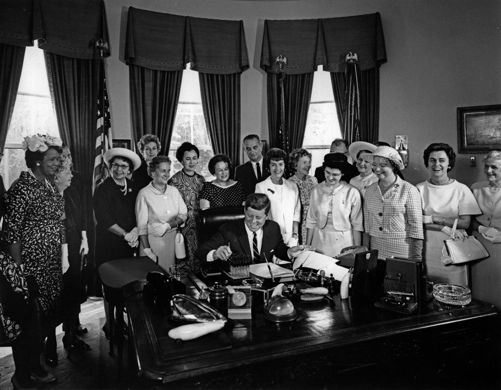

# Rewriting Women’s Stories on the Silver Screen 

The perception and role of women in the US society has greatly evolved during the past century with women being granted a myriad of new rights. Simultaneously, their perception has also evolved, shifting away from mere housewives. Movies are often seen as a reflection of society, moving along with its ebbs and flows. But has this specific social movement bled into the entertainment industry? Has the depiction of women progressed alongside important milestones in the Feminist movement? Or on the contrary, do stereotypes around women still prevail in Hollywood?

This data story will explore the <a href="http://www.cs.cmu.edu/~ark/personas/"><em>CMU Movie Summary Corpus</em></a> to explore how women are portrayed in Hollywood. Not only by mere representation but whether women are now being put at the forefront of storylines. It will also dive deeper into the characteristics of stereotypical movies.

## Representation of women in movies across time
As a first step into this it is logical to wonder about the representation of women through time. The proportion of actresses over time gives us a first insight into how well the industry is representing society.  According to Martha Lauzen from the San Diego State’s Center for the Study of Women in Television and Film, “Despite the major disruptions in the film business over the last couple of years, onscreen gender ratios have remained relatively stable.”[^1] But what about going back 100 years, has society progressed at all ?

<object>
  <iframe frameborder="no" border="0" marginwidth="0" marginheight="0" width="700" height="550" src="html_plots/proportion_men_women.html"></iframe>
</object>

  <a href="html_plots/proportion_men_women.html">Figure 1</a>

As we can see the ratios have remained fairly constant over time,  hitting a proportion of women between 30% and 40%, close to a 2 to 1 ratio. However we can see a small but interesting trend starting in the 70s, with the proportion of women slowly but steadily increasing. If the industry keeps evolving at this rate, by fitting a regression through this time period, we could naively say that parity would be reached in 2064. This of course only reflects a thought experiment that helps us understand the overall trend. But can this trend be explained by any significant event in history ? By using our [timeline](https://www.history.com/topics/womens-history/womens-history-us-timeline), two major events for women's rights in the US in fact occurred in the 60s: the Equal Pay Act and the Civil Rights Act. The Equal Pay Act prohibits a difference of salary based on sex while the Civil Rights Act prohibits (amongst others) employment discrimination based on sex. These two events were a huge step towards gender equality and they might have prompted a change in mentality, resulting in the proportion of women in movies increasing.

<figure class="sidenote">
    
    <figcaption><a href="https://en.wikipedia.org/wiki/Equal_Pay_Act_of_1963"><em>Figure 2.</em></a> Signing of the Equal Pay Act of 1963.</figcaption>
</figure>

### Breakdown of women's representation in movies

Nevertheless, this result doesn't mean that each movie has approximately 30-40% of women in their actors cast. This result might be biased by movies that have an extremely low/high proportion of women versus movies that have a balanced actors cast.

<object>
  <iframe frameborder="no" border="0" marginwidth="0" marginheight="0" width="700" height="550" src="html_plots/movie_proportions.html"></iframe>
</object>

This is in fact what we see with the plot above. Indeed over 85% of movies have less than 50% of actresses  in their cast. So while we may think from the plot before that women represent 40% of characters in movies, this plot demystifies this idea. Nonetheless, from 2000 onwards there is a growing number of movies with a majority of women actors in their cast. Breaking this down further by genre we can look more precisely at the individual trends. 

<object>
  <iframe frameborder="no" border="0" marginwidth="0" marginheight="0" width="700" height="550" src="html_plots/movie_proportions_percentages_actress_by_genre.html"></iframe>
</object>

Interestingly, three genres stick out as much worse than the average: Action, Western and Drama. In those genres, over 50% of movies that have less than 25% of women in them. On the contrary, three genres seem to do slightly better than the average namely Musical, Adventure and Horror. This shows that all genres aren’t equal when it comes to women representation. 

### Is the age gap even real? 
> Male actors see their careers peak at the age of 46, female actors reach their professional pinnacles at age 30  _TIME magazine 2015[^2]_

There is in fact not only a gap in representation but also in the age of actors versus actresses. Often times it seems that the actresses are significantly younger than their male counterparts. It is not only an impression, this can in fact be seen very well in this plot

<object>
  <iframe frameborder="no" border="0" marginwidth="0" marginheight="0" width="700" height="550" src="html_plots/Average_age_actor.html"></iframe>
</object>

On average, female actors are **significantly** younger than men at any point throughout the last century. This clearly emphasises the age gap in the industry. Moreover, the average age of actors increases over time regardless of gender, potentially reflecting the long career span of actors. As a matter of fact, an actor starting in the 60s might be playing well into the 80s. But throughout this maturing of the industry, the age gap does not get smaller. This next animation we clearly see the exact breakdown of actors and actresses throughout the decades. TO ADD: more analysis here (Distributions are skewed towards the left and heavy tailed)

<object>
  <iframe frameborder="no" border="0" marginwidth="0" marginheight="0" width="700" height="550" src="html_plots/age_distribution_plot.html"></iframe>
</object>

Now all of this does not tell us in any way **how** women are portrayed in these movies. We've seen that women's representation is increasing but what kind of representation ? 

## Is women representation shifting towards major roles ? 
Having a women lead is much more meaningful than adding only female secondary characters. It is therefore crucial to be able to differentiate the two. 

<iframe frameborder="no" border="0" marginwidth="0" marginheight="0" width="700" height="550" src="html_plots/main_char_ratio.html"></iframe>

It is interesting to point out the initial decrease that occurred from the 1910s until the 40s.  The lack of data in the earliest decades could bias the original two decades (10s and 20s), only including a few movies where women portrayed main roles. The confidence interval is indeed the largest sound these decades. Furthermore, it could be tempting to say that we start to see an increase starting in the 40s. However this cannot be conclusively said due to the large confidence intervals up until the 1990s.  There has been an Increase in recent decades, but we cannot be sure exactly when this trend started. Nonetheless this is a further insight indicating that women are being offered an increasing amount of leading roles. What events may have prompted this around the 80s?

- 1981 :  Sandra Day O’Connor is sworn in by President Ronald Reagan as the first woman to serve in the U.S. Supreme Court. She retired in 2006, after serving for 24 years.
- 1983 :  Flying on the Space Shuttle Challenger, Sally Ride becomes the first American woman in space.
- 1984 :  Democratic presidential nominee Walter Mondale names U.S. Rep. Geraldine Ferraro (N.Y.) as his running mate, making her the first woman vice president nominee by a major party.

We thus see women accessing political positions that were so far only occupied by men. Moreover, this decade saw the first American into space. Seeing women accessing jobs that previously seemed out of reach may have impacted society. Therefore, as Hollywood picked up on these cues and wanting to reflect the advancement of mentalities, it portrayed more women in main character roles. In 2022, our analysis suggests that 41.1% of main characters are women. According to the San Diego State University Center for the Study of Women in Television and Film, in 2022, females comprised 44% (43.8%) of major characters. [^3] (POTENTIALLY ADD TEXT ABOUT SUBPLOTS)

<iframe frameborder="no" border="0" marginwidth="0" marginheight="0" width="700" height="550" src="html_plots/proportion_main_characters_per_genre.html"></iframe>

If you’ve made it so far, that’s great! What have we learned?  
<h3>&#x2713;</h3> The overall proportion of women has increased in the last 50 years to reach ~40% of actresses
- [x] That does **not** mean that all movies have 40% of women! Some genres have more women than others like Musical or Adventure movies, whereas Westerns or Drama are trailing behind. 
- [x] The age gap in Hollywood is still a thing and does not seem to be closing down, though the mean age of both men and women in the industry is increasing. 
- [x] The kind of representation matters, and we do see an increase in women main character roles. 

## Clustering of movies

What do you think of when you think of a stereotypical portrayal of a woman ? Does a young pretty actress that does not contribute to the plot pop into your mind? Being able to classify a movie into stereotypical or non-stereotypical is very valuable in this case. By clustering movies based on the proportion of women, the proportion of women main characters and the difference in the mean ages of men and women in the cast, we were able to cluster all movies into 3 categories. A cluster of stereotypical movies (cluster 1), a cluster of non-stereotypical movies (cluster 0), and finally a cluster that falls somewhere in between, not extreme enough to fall into either category (cluster 2).  

<figure class="sidenote">
    
    <figcaption>Figure 3. Clustering of Stereotypical and non stereotypical movies.</figcaption>
</figure>

Cluster 0 has a higher proportion of women in the cast, also as main character and a smaller difference of mean ages than the other clusters. Cluster 1 is the most stereotypical, with no women as main characters, a low proportion of actresses, and the highest mean age difference. 

| cluster index | proportion of women | proportion fo women main characters | difference in mean ages |
|---------------|---------------------|-------------------------------------|-------------------------|
| 0             | 0.531               | 0.978                               | -6.755                  |
| 1             | 0.321               | 0                                   | -8.079                  |
| 2             | 0.398               | 0.461                               | -7.197                  |

What has been the evolution of the release of these 2 types of movies you may ask! 

<iframe frameborder="no" border="0" marginwidth="0" marginheight="0" width="700" height="550" src="html_plots/fraction_stereo_movies_per_decades.html"></iframe>

From 1920 up to 2020, there seem to always have been a bigger percentage of movies produced that had a stereotypical depiction of women. In the 70s the proportion of stereotypical movies was almost 50% and is the highest in the years analysed. Of course, due to the large confidence intervals that result should be taken with some precaution. Interestingly, the proportion of non-stereotypical movies was relatively stable throughout the decades until 2000. From 2000 to 2020 we see a strong increase of the proportion of movies with a non-stereotypical depiction of women to reach approximately the same percentage as stereotypical movies. (YAY!) Going back to our beloved timeline, multiple events where women ascended to a position of power could have prompted this increase, such as the first female attorney, the first female secretary of state or the first female speaker of the house.

Now that we have a way of categorising these movies and we’ve seen the release trends, what genres are overrepresented into our two clusters of interest ? Reminder that previously we saw that 
- Musical
- Adventure
- Horror
  
genres tended to do better in terms of women proportion in their cast. Whereas 
- Action 
- Western
- Drama
  
tend to do worse. Now how does that compare to this clustering ? When  looking at the difference of ratio between the not stereotypical and the stereotypical movies, we obtain the next plot. If the difference is negative it means that there is a higher proportion of this movie genre in the stereotypical movies. Inversely, if the difference is positive, it means that there is a higher proportion of this movie genre in the non-stereotypical movies. We thresholded the graph to only see movies that had a difference bigger than 0.01. We assumed that a smaller difference was too small to assume a real difference between the clusters.

<iframe frameborder="no" border="0" marginwidth="0" marginheight="0" width="700" height="550" src="html_plots/clustering_genre_barplot.html"></iframe>

Action and Western still fall into the category of stereotypical as expected by the previous analysis.  Similarly, but on the other side of the spectrum, Horror and Musical are in the  non-stereotypical cluster. Surprisingly, Drama and Adventure are not on the side we would expect. Indeed, we previously saw that Drama had low women representation, but is actually overrepresented into the non-stereotypical cluster, and Adventure has a similar trend but in the opposite direction. 

There are of course limitations with this analysis. Most prevalently, we see that romantic comedies appear in movies that have a non-stereotypical representation of women. It is however well-known that in general in romantic comedies women are solely love interests and are thus portrayed stereotypically. This highlights the need to not only look at the proportion of actresses, the proportion of women character and the age difference but consider other factors. More precisely **the vocabulary linked** to female and male actors in general. This is a perfect segue into our final analysis: *The Vocabulary Analysis*

# References 
[^1]: [The Hollywood Reporter, *Study Finds Women Represent a Third of Onscreen Population in Film*, 2022](https://www.hollywoodreporter.com/movies/movie-news/women-onscreen-representation-film-study-1235111493/)
[^2]: [TIMES magazine, *This Chart Shows Hollywood’s Glaring Gender Gap*, 2015](https://time.com/4062700/hollywood-gender-gap/)
[^3]: [San Diego State University center for STudy of Women in Television and Film, *Streaming Women: Representation and Employment in Original U.S. Films Released by Streaming Services in 2022*, 2023](https://womenintvfilm.sdsu.edu/research/#:~:text=Females%20comprised%2044%25%20(43.8%25),producers%2C%20editors%2C%20and%20cinematographers.)
